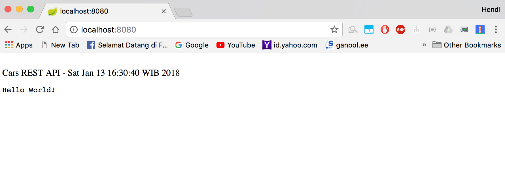
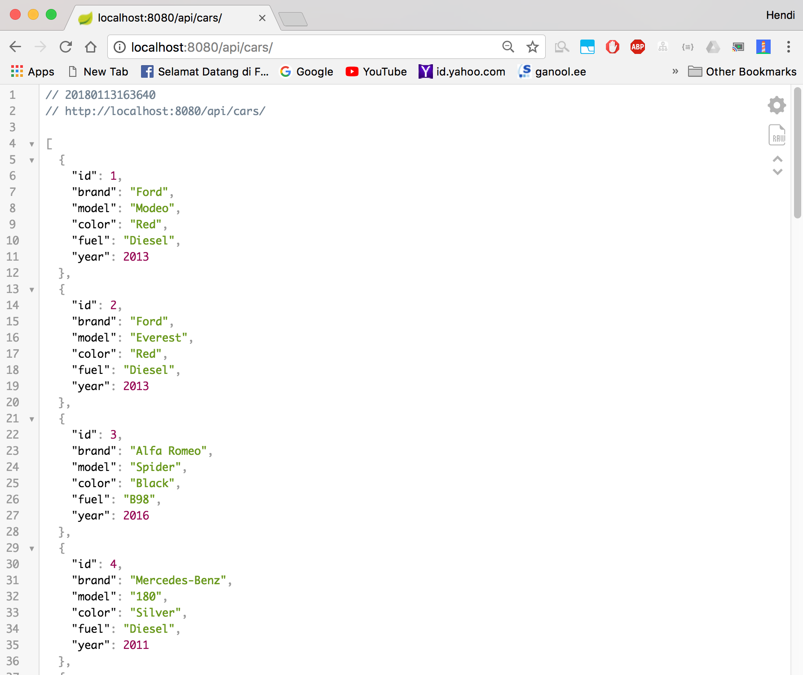

# Spring Boot Cars Rest Service

Simple REST API for Basic Learning

Home Page

`http://localhost:8080`

All Cars

`http://localhost:8080/api/cars`

Find Car by Id

`http://localhost:8080/api/cars/1`

Distinct Car by Brand & Color

`http://localhost:8080/api/cars/brand`